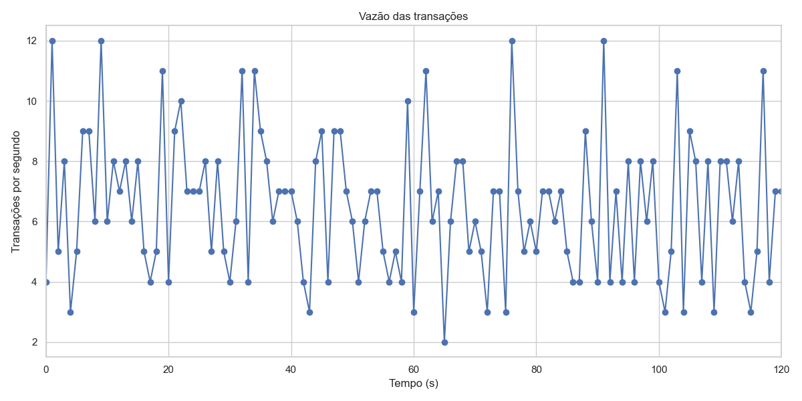
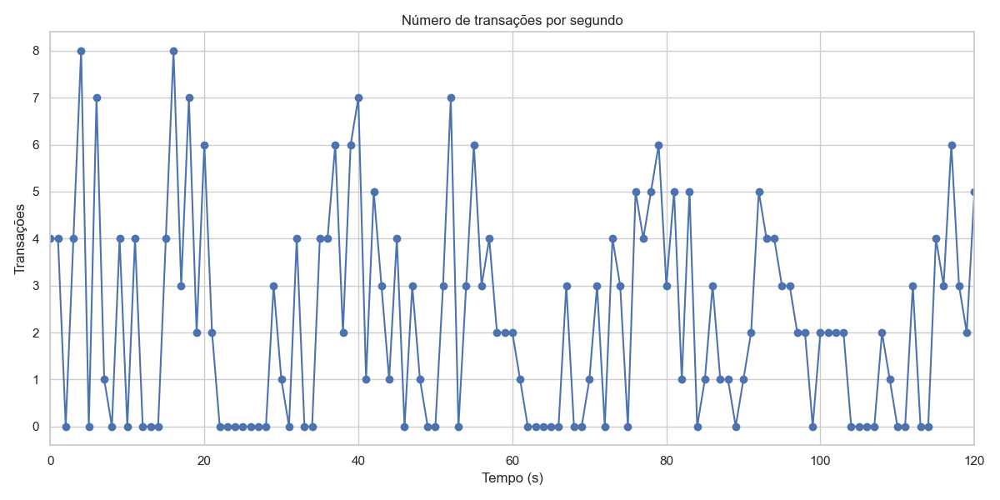

# Análise Comparativa de Desempenho – Benchmark TPC-H (PostgreSQL 16 vs SQL Server 2022 – 120s)

## 1. Introdução
Este relatório apresenta os resultados da execução do benchmark **TPC-H** sobre dois Sistemas de Gerenciamento de Banco de Dados (SGBDs):  
- **PostgreSQL 16** (configuração padrão)  
- **SQL Server 2022** (instância padrão)  

Os experimentos foram realizados com **carga concorrente** e **tempo total de execução de 120 segundos**, a fim de estabelecer um **baseline de desempenho** para consultas analíticas (OLAP) sob múltiplos usuários.

---

## 2. Ambiente Experimental

### Configuração Comum
- **Benchmark:** TPC-H, fator de escala 1 (SF=1)
- **Execução:** Consultas pré-carregadas em views (`SELECT * FROM q1 ... q22`)
- **Tempo total de execução:** 120 segundos por thread
- **Hardware:**
  - Modelo: Dell Inspiron 16 Plus 7640
  - **Processador:** Intel Core Ultra 7  
  - **Memória RAM:** 32 GB  
  - **Armazenamento:** SSD 1 TB  
  - **GPU:** NVIDIA GeForce RTX (não utilizada nas consultas)
- **Sistema de arquivos:** NTFS
- **Ferramentas:**
  - Python 3.13
  - Bibliotecas `psycopg2` (PostgreSQL) e `pyodbc` (SQL Server)
  - Script customizado `run_tpch.py` (execução concorrente e geração de CSV)
  - `matplotlib` e `seaborn` para visualização

### Configuração por SGBD
- **PostgreSQL 16:** 4 threads (usuários simulados)
- **SQL Server 2022:** 4 threads (usuários simulados)

---

## 3. Metodologia
O script [`run_tpch.py`](./run_tpch.py) foi utilizado para:
- Criar **threads simultâneas** representando usuários concorrentes;
- Executar continuamente as **22 queries do TPC-H** por 120 segundos;
- Registrar **tempo de execução individual** (em segundos), timestamps e número de execução;
- Exportar os resultados em **arquivos CSV** separados por usuário.

---

## 4. Resultados

### 4.1. Estatísticas descritivas por query

#### PostgreSQL 16
| Query | Tempo Médio (s) |
|-------|-----------------|
| Q1    | 1.5943 |
| Q2    | 0.9531 |
| Q3    | 1.0383 |
| Q4    | 0.1449 |
| Q5    | 1.8322 |
| Q6    | 0.7621 |
| Q7    | 2.2977 |
| Q8    | 2.4549 |
| Q9    | 4.3028 |
| Q10   | 0.9696 |
| Q11   | 0.2273 |
| Q12   | 1.0175 |
| Q13   | 0.9160 |
| Q14   | 0.3173 |
| Q15   | 1.2695 |
| Q16   | 0.2947 |
| Q17   | 9.6601 |
| Q18   | 3.4028 |
| Q19   | 2.3970 |
| Q20   | 1.0456 |
| Q21   | 1.3839 |
| Q22   | 0.1915 |

**Vazão:** **34.31 queries por minuto** (≈ 69 queries processadas em 2 minutos)

#### SQL Server 2022
| Query | Tempo Médio (s) |
|-------|-----------------|
| Q1    | 0.5122 |
| Q2    | 0.3554 |
| Q3    | 0.5988 |
| Q4    | 0.4758 |
| Q5    | 0.7432 |
| Q6    | 0.5945 |
| Q7    | 1.0206 |
| Q8    | 0.8937 |
| Q9    | 0.8995 |
| Q10   | 0.6422 |
| Q11   | 0.4060 |
| Q12   | 0.7278 |
| Q13   | 0.7140 |
| Q14   | 0.5126 |
| Q15   | 0.5230 |
| Q16   | 0.1843 |
| Q17   | 0.5099 |
| Q18   | 0.6218 |
| Q19   | 0.5142 |
| Q20   | 0.4304 |
| Q21   | 1.5221 |
| Q22   | 0.0844 |

**Vazão:** **97.88 queries por minuto** (≈ 196 queries processadas em 2 minutos)

---

### 4.2. Gráficos comparativos

**Tempo médio por query (PostgreSQL vs SQL Server)**  

**Total de queries processadas em 2 minutos**  

SQL Server

Postgre

---

### 4.3. Ranking das queries

#### **Top 5 Queries mais rápidas (por SGBD)**
| Query | PostgreSQL (s) | SQL Server (s) |
|-------|----------------|----------------|
| Q4    | 0.145          | 0.476          |
| Q22   | 0.191          | 0.084          |
| Q11   | 0.227          | 0.406          |
| Q16   | 0.295          | 0.184          |
| Q14   | 0.317          | 0.513          |

#### **Top 5 Queries mais lentas (por SGBD)**
| Query | PostgreSQL (s) | SQL Server (s) |
|-------|----------------|----------------|
| Q17   | 9.660          | 0.510          |
| Q9    | 4.303          | 0.899          |
| Q18   | 3.403          | 0.622          |
| Q8    | 2.455          | 0.894          |
| Q19   | 2.397          | 0.514          |

---

## 5. Discussão
- **SQL Server apresentou desempenho consistentemente superior**, com tempos menores em todas as queries do TPC-H.  
- A **vazão do SQL Server foi quase 3x maior** que a do PostgreSQL (196 vs 69 queries processadas em 2 minutos).  
- **Consultas mais custosas** no PostgreSQL (como Q9, Q17 e Q18) tiveram tempos significativamente reduzidos no SQL Server.  
- O PostgreSQL demonstrou **maior variabilidade nos tempos** de execução, especialmente em consultas complexas.  
- Ambos os ambientes estavam em **configuração padrão**, o que indica que ainda há margem para otimizações (paralelismo, ajustes de buffers e cache).  

---

## 6. Conclusão
Os experimentos mostraram que o **SQL Server 2022** possui desempenho superior ao **PostgreSQL 16** no benchmark TPC-H em ambiente não otimizado, tanto em **tempo médio por query** quanto em **vazão total**.  
Esses resultados fornecem um **baseline sólido** para comparações futuras com ambientes ajustados e diferentes fatores de escala.

